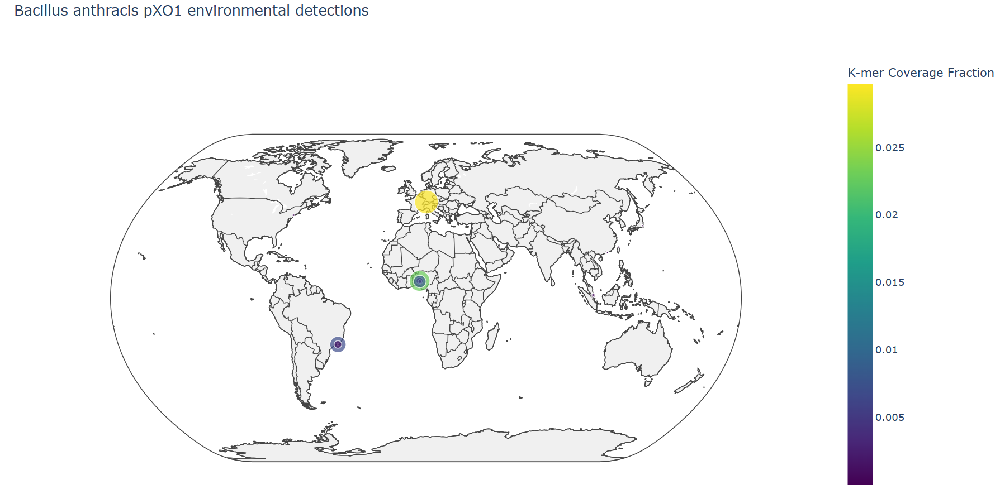
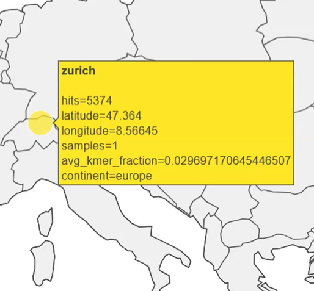

# Pathogen Surveillance

## Overview

This project explored a scalable workflow for connecting large-scale pathogen sequence search results with environmental and geographic metadata analysis.

The primary objective was not full genomic characterization, but rather the development of a pipeline capable of:
- querying large sequencing indexes,
- retrieving matched accessions,
- linking those matches to metadata repositories,
- filtering usable metadata fields,
- and generating spatial representations of the resulting data.

The workflow focused heavily on metadata integration, normalization, and downstream geographic interpretation.

---

## Core Workflow

The overall pipeline followed a multi-stage process:

1. Select a pathogen, marker, or genomic target.
2. Query large-scale sequence indexing/search tools such as MetaGraph, Logan, sourmash branchwater.
3. Retrieve matching accessions from search results.
4. Cross-reference accessions against associated metadata repositories.
5. Extract usable attributes such as:
   - geographic coordinates,
   - environmental source information,
   - host metadata,
   - collection details,
   - and sample descriptors.
6. Normalize inconsistent metadata formats.
7. Filter incomplete or unusable records.
8. Map resulting geographic data for downstream analysis and visualization.

---

## Metadata Processing

A significant portion of the project involved handling real-world metadata inconsistencies across biological repositories.

Examples of issues encountered included:
- malformed latitude/longitude values,
- missing geographic fields,
- inconsistent environmental descriptors,
- duplicated accession relationships,
- variable formatting standards,
- and incomplete sample annotations.

Custom parsing and filtering workflows were developed to identify usable records and prepare them for geospatial analysis.

---

## Spatial Mapping & Interpretation

After metadata extraction and cleanup, geographic information was transformed into map-compatible datasets for visualization and exploratory analysis.

The visualization below represents environmental detections associated with *Bacillus anthracis* pXO1-related sequence signatures across globally distributed samples.



Each plotted point represents a metadata-linked sample location where sequence search results produced measurable matches against the target reference.

The visualization incorporates a **k-mer coverage fraction** metric, which represents the proportion of target k-mers detected within a given sample.

---

## Understanding the Detection Metrics

The mapping workflow did not simply record whether a match existed, it also attempted to quantify *how strongly* a sample matched the target sequence.

Several metrics were incorporated into the visualization pipeline:

### Hits
Represents the total number of matching sequence fragments or k-mers identified for a given sample or location.

Higher hit counts generally indicate:
- stronger sequence overlap,
- increased representation of the target signal,
- or richer supporting sequence evidence.

---

### K-mer Coverage Fraction

The `avg_kmer_fraction` metric represents the fraction of target k-mers successfully identified within a sample.

This becomes extremely important in large-scale environmental screening because it provides a lightweight approximation of sequence similarity without requiring expensive full-genome alignment.

Higher k-mer fractions typically indicate:
- stronger genomic similarity,
- more complete target representation,
- or higher-confidence detections.

Lower values may instead reflect:
- weak environmental traces,
- fragmented detections,
- low-abundance sequence presence,
- or partial overlap with related organisms.

---

## Example Location Interpretation

Below is an example tooltip generated from one mapped detection:



This example represents a metadata-linked environmental detection associated with Zurich, Switzerland.

The tooltip contains several useful attributes:
- geographic coordinates,
- total hit count,
- number of linked samples,
- regional classification,
- and average k-mer coverage fraction.

### Example Breakdown

```text
hits = 5374
samples = 1
avg_kmer_fraction = 0.0297
```

### Interpretation

- The relatively large hit count suggests strong sequence overlap against the target reference.
- The elevated k-mer coverage fraction indicates a comparatively stronger detection signal relative to weaker environmental traces elsewhere in the dataset.
- Since the sample count is small, the signal is concentrated within a limited number of linked metadata records rather than distributed across many samples.

Marker size and coloration in the visualization were scaled using these metrics, allowing stronger detections to stand out geographically.

---

## Why This Matters

One of the major goals of the project was demonstrating how large-scale sequence search outputs could be transformed into geographically interpretable datasets.

Rather than manually reviewing thousands of accessions independently, the workflow enabled:
- rapid environmental signal exploration,
- geographic clustering analysis,
- metadata-driven filtering,
- and visual interpretation of distributed pathogen-related detections.

Importantly, the visualization does **not** imply confirmed outbreaks or active environmental presence. Instead, it represents metadata-linked sequence detections derived from indexed biological datasets.


## Notes

This repository serves as a high-level overview of the project workflow and methodology.

Certain implementation details, datasets, and internal processing steps have intentionally been abstracted.
